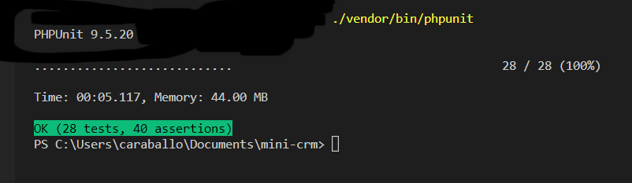

# Mini-CRM

This project is based on [How to Test Junior Laravel Developer Skills: Sample Project](http://laraveldaily.com/test-junior-laravel-developer-sample-project).
A sample project for junior/mid laravel developer from Laravel Daily.

## Software Requirements

This project was built with Laravel 9.17.0, PHP 8.1.1 and mysql Ver 15.1 Distrib 10.4.22-MariaDB

## User Requirements

* [x] User Auth with Breeze: log in only as administrator.
* [x] Use database seeds to create first user with email admin@admin.com and password "password".
* [x] CRUD functionality (Create / Read / Update / Delete) for menu items: Companies and Employees.
* [x] Companies DB table with these fields: Name (required), email, logo (minimum 100×100), website
* [x] Employees DB table with these fields: First Name (required), last name (required), Company (foreign key to Companies), email, phone
* [x] Use database migrations to create those schemas above
* [x] Store companies logos in storage/app/public/images folder and make them accessible from public
* [x] I have implemented Route:groups and Route::resorces
* [x] Use Laravel's validation function, using Request classes
* [x] Use Laravel's pagination for showing Companies/Employees list, 10 entries per page
* [x] I have used [Breeze](https://laravel.com/docs/9.x/starter-kits#laravel-breeze).
* [x] PHPUnit Tests

### Some Modifications I have made

* [x] To apply the Single responsibility principle (SPR) of SOLID, I have used Requests for the rules and Services classes for the Logic.
* [x] In the Routes I have implemented Route:groups and Route::resorces.
* [x] I have implemented Route Model Binding, less code.

## How to Install

1. Clone the repo : `git clone https://github.com/maqndon/mini-crm.git`
2. `$ cd Mini-CRM`
3. `$ composer install`
4. `$ cp .env.example .env`
5. `$ php artisan key:generate`
6. `mysql -u USER -p`
7. Set database credentials on the `.env` file
8. `$ php artisan migrate --seed`
9. `$ php artisan storage:link`
10. `$ php artisan serve`
11. Login with :
    - email : `admin@admin.com`
    - password : `password`

## Screenshots

#### Login

#### Company List

#### Employee List

#### Company Details

#### Employee Details

#### PHPUnit Tests

## License

This software is open-sourced software licensed under the [MIT license](LICENSE).
